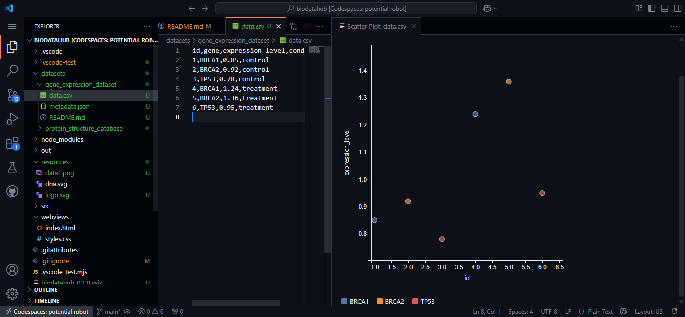
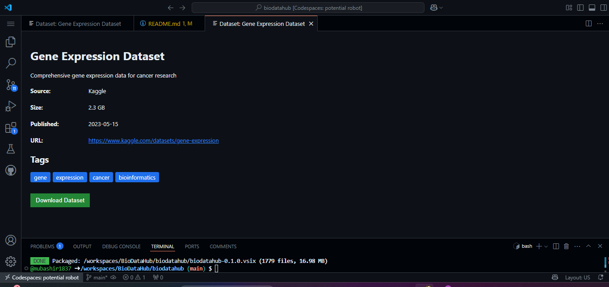

# Bio-Data-Hub


## Overview

**Bio-Data-Hub** is a powerful Visual Studio Code extension designed for bioinformatics professionals and data scientists. It simplifies the exploration, visualization, and management of CSV datasets, enabling users to analyze biological data efficiently.

## Features

- **Search Local Datasets**: Quickly locate datasets on your machine.
- **Search Online Datasets**: Access online repositories for bioinformatics datasets.
- **Download Datasets**: Fetch datasets directly into your workspace.
- **Preview CSV Files**: View CSV data in a clean and organized format.
- **Generate Metadata**: Automatically create metadata for datasets.
- **Visualize Data**: Generate visualizations for better insights.
- **Export Data**: Save processed data for further use.

## Installation

1. Open Visual Studio Code.
2. Go to the Extensions view by clicking on the Extensions icon in the Activity Bar.
3. Search for `Bio-Data-Hub`.
4. Click **Install**.

Alternatively, clone the repository and build the extension locally:

```bash
git clone https://github.com/mubashir1837/BioDataHub.git
cd BioDataHub
npm install
npm run build
```

## Usage

### Commands

| Command                              | Description                              | Shortcut         |
|--------------------------------------|------------------------------------------|------------------|
| `BioDataHub: Search Local Datasets`  | Search for datasets locally.             | -                |
| `BioDataHub: Search Online Datasets` | Search for datasets online.              | -                |
| `BioDataHub: Download Dataset`       | Download datasets from online sources.   | -                |
| `BioDataHub: Preview CSV`            | Preview CSV files in the editor.         | `Ctrl+Shift+P`   |
| `BioDataHub: Generate Metadata`      | Generate metadata for datasets.          | `Ctrl+Shift+M`   |
| `BioDataHub: Visualize Data`         | Visualize CSV data.                      | `Ctrl+Shift+V`   |
| `BioDataHub: Export Data`            | Export processed data.                   | -                |

### Context Menu

Right-click on a `.csv` file in the Explorer to access the following options:

- Preview CSV
- Generate Metadata
- Visualize Data

## Screenshots

### Activity Bar Integration


### Dataset View


## Keybindings

| Keybinding         | Command                  | When Condition       |
|--------------------|--------------------------|----------------------|
| `Ctrl+Shift+P`     | Preview CSV             | `editorLangId == csv` |
| `Ctrl+Shift+M`     | Generate Metadata       | `editorLangId == csv` |
| `Ctrl+Shift+V`     | Visualize Data          | `editorLangId == csv` |

## Development

### Scripts

- **Compile**: `npm run compile`
- **Watch**: `npm run watch`
- **Lint**: `npm run lint`
- **Test**: `npm run test`

### Dependencies

| Dependency         | Version   |
|--------------------|-----------|
| `axios`            | `^1.6.2` |
| `csv-parser`       | `^3.2.0` |
| `d3`               | `^7.0.0` |
| `minimatch`        | `^3.1.2` |
| `path`             | `^0.12.7` |
| `webview`          | `^1.1.0` |

### Dev Dependencies

| Dependency                 | Version   |
|----------------------------|-----------|
| `@eslint/js`               | `^9.22.0` |
| `@types/chai`              | `^5.2.0` |
| `@types/glob`              | `^8.1.0` |
| `@types/mocha`             | `^8.2.3` |
| `@types/node`              | `^14.18.63` |
| `@types/vscode`            | `^1.64.0` |
| `@typescript-eslint/eslint-plugin` | `^8.27.0` |
| `@typescript-eslint/parser` | `^8.27.0` |
| `chai`                     | `^5.2.0` |
| `electron`                 | `^35.0.3` |
| `eslint`                   | `^9.22.0` |
| `eslint-config-prettier`   | `^10.1.1` |
| `eslint-plugin-prettier`   | `^5.2.3` |
| `glob`                     | `^7.2.3` |
| `globals`                  | `^16.0.0` |
| `mocha`                    | `^11.1.0` |
| `prettier`                 | `^3.5.3` |
| `ts-node`                  | `^10.9.2` |
| `typescript`               | `^4.9.5` |
| `typescript-eslint`        | `^8.27.0` |
| `vscode-test`              | `^1.5.2` |

## Repository

[GitHub Repository](https://github.com/mubashir1837)

## Social Links

[](https://www.linkedin.com/in/mubashirali3/)
[](https://github.com/mubashir1837)

## License

This project is licensed under a **Private License**. Unauthorized copying, distribution, or modification is prohibited.

## Contributing

Contributions are welcome! Please fork the repository and submit a pull request.

## Support

For any issues or feature requests, please open an issue on the [GitHub Repository](https://github.com/mubashir1837/BioDataHub/issues).

---

Happy coding with **Bio-Data-Hub**! 🚀  