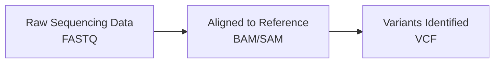

# Bioinformatics File Formats Guide
---
The ultimate beginner, no-brainer, an absolute non-bio guide to common bioinformatics file formats. 

## Before we dive in- What is a bioinformatics file format, anyway?

You already know what a file format is. A `.jpg` is an image, an `.mp3` is audio, a `.docx` is a Word document. Each format has rules about how information is stored inside it, so that software knows how to read it.

Bioinformatics file formats are exactly the same idea- just for **biological data**. DNA sequences, genetic variants, genome coordinates- all of this data needs to be stored *somewhere*, in a way that analysis tools can read and process. That's what these formats are.

You don't need a biology degree to understand them. You just need to know what each one stores and what it looks like. 
That's exactly what this guide is for.

---

### Before we actually dive deep into the file formats, here is what you actually need to understand first: the SOURCE (simple right?)
Any type of file format is usually generated after an extensive process of sequencing the DNA. In simpler terms, when you get the DNA from a lab, you run it through a machine called a ***"sequencer"***. The sequencer converts the DNA into a computer file- basically digitalises it. In this way you can see what the DNA sequence of the sample actually is- on your computer! (cool stuff i know)

From that point on, the raw data goes through a series of analysis steps, getting cleaned, processed, and transformed. And at each stage, the data lives in a different file format.
Here's a very simplified version of that journey:




Now- you have the DNA sequence in a very messy format that undergoes a number of analysis steps. This guide won't cover all of those steps- but knowing they exist gives you context for *why* these formats exist. Each one solves a specific problem at a specific stage.

The formats we'll cover are the ones you're most likely to encounter as a beginner:

| Format | What it stores |
|--------|---------------|
| VCF | Genetic variants |
| FASTA | DNA/protein sequences |
| FASTQ | Raw sequencing reads + quality scores |
| BED | Genomic coordinates / regions |
| CSV/TSV | Tabular biological data |

---

## 1. VCF (Variant Call Format)

### What is it?
A VCF file stores information about genetic variants or positions in the genome where individuals differ from a reference genome. It is the standard format used in SNP analysis, GWAS studies, and clinical genomics.
It is called a 'variant call' format because it stores information about 'variants'.
### But......what are variants?
Okay so imagine you and your friend both have the same book- same title, same edition. But in your copy, page 47 has the word "cat". But at the same position, on the same page, your friend's copy says "bat". Same book, one tiny difference. That one-letter swap? That's basically a variant.

In DNA terms, a variant is a position in the genome where your DNA sequence differs from the "reference" genome (think of the reference as the "official" version scientists use as a baseline). These differences can be:

#### 1- A single letter swap
One DNA base (A, T, C, or G) is different. This is called a SNP (Single Nucleotide Polymorphism- don't worry about the name, just know it's the most common type).
#### 2- A small insertion or deletion
A letter or two got added or removed. These are called indels ('in' for insertion and 'del' for deletion).
#### 3- Larger structural changes 
Bigger chunks of DNA that got moved, duplicated, or flipped.

A VCF file is essentially a big spreadsheet of all these "typos" found in a DNA sample, along with information about where in the genome they are (position), what the change is, and how confident the analysis pipeline is that the variant is real (and not just a sequencing error).


### What does it look like?
Here's a tiny snippet of what a real VCF file looks like when you open it:

```
##fileformat=VCFv4.2
##reference=GRCh38
##INFO=<ID=DP,Number=1,Type=Integer,Description="Total Depth">
#CHROM  POS     ID        REF  ALT  QUAL  FILTER  INFO
chr1    925952  rs1234567  A    G    99    PASS    DP=42
chr1    931279  .          C    T    45    PASS    DP=18
```
Scary? Don't worry. 
Let's break it down into two parts: ***the header and the data rows.***
#### The header (all the lines starting with #)
These lines are basically the file's autobiography (or metadata in the bioinfo world). They describe how the file was made, what reference genome was used, and what all the column abbreviations mean. You don't need to memorise any of it. Just know it's there, and it's useful when things go wrong.

#### The data rows (the actual variants)
Each row is one variant. The columns are:
| Column | What it means |
|--------|---------------|
| `CHROM` | Which chromosome the variant is on |
| `POS` | The exact position on that chromosome |
| `ID` | A known name for the variant (or `.` if unknown) |
| `REF` | The reference base- what the "official" genome has |
| `ALT` | The alternate base- what this sample has instead |
| `QUAL` | How confident the pipeline is that this variant is real |
| `FILTER` | Did it pass quality checks? (`PASS` = yes, good) |
| `INFO` | Extra information, like how many reads covered this position |

So that first data row? It's saying: ***"On chromosome 1, at position 925,952, the reference genome has an A- but this sample has a G instead. We're very confident about it (QUAL=99), it passed all filters, and 42 sequencing reads covered this spot."***

Not so scary now, is it?

---

## 2. FASTA

### What is it?

FASTA is one of the oldest and most universal formats in bioinformatics. It stores **biological sequences**: DNA, RNA, or protein- in plain text. If VCF is about *differences* in a genome, FASTA is about the actual *sequence itself*.

You'll encounter FASTA files constantly- reference genomes are distributed as FASTA files, gene sequences are shared as FASTA files, and most analysis tools expect FASTA as input at some point. They commonly come with .gz extension in case the file is too big. 

### What does it look like?

```
chr1 Homo sapiens chromosome 1
ATGCTAGCTAGCTAGCTAGCTAGCTAGCTAGCTAGCTAGCTAGCTAGCTAGCTAGCTAGC
TAGCTAGCTAGCTAGCTAGCTAGCTAGCTAGCTAGCTAGCTAGCTAGCTAGCTAGCTAGC


chr2 Homo sapiens chromosome 2
GCTAGCTAGCTAGCTAGCTAGCTAGCTAGCTAGCTAGCTAGCTAGCTAGCTAGCTAGCTA
```
It's actually one of the simplest formats out there. Every entry has just two parts:

- **The header line:** Starts with `>`, followed by the sequence name and any description you want.
- **The sequence:** The actual A, T, C, G letters, usually split across multiple lines for readability.

That's it. No columns, no metadata, no special syntax. Just a name and a sequence.

One FASTA file can contain a single sequence or thousands of them. Each new `>` line starts a new entry. A whole human reference genome, for example, is one big FASTA file with 24 entries (one per chromosome).

---

## 3. FASTQ

### What is it?

FASTQ is the format that comes straight out of a sequencer- it's the **raw sequencing data**. Think of it as FASTA's more information-rich cousin. The difference is in the 'Q' in FASTQ- i.e. it also stores **quality scores** alongside each base, telling you how confident the sequencer was when it read each letter of the DNA. 

This matters because sequencers aren't perfect. Sometimes a base is read with high confidence, sometimes the machine is basically guessing. Quality scores let downstream analysis tools know which parts of the data to trust and filter accordingly.

### What does it look like?

```
@SRR001666.1 071112_SLXA-EAS1_s_7:5:1:817:345 length=36
GGGTGATGGCCGCTGCCGATGGCGTCAAATCCCACC
+
IIIIIIIIIIIIIIIIIIIIIIIIIIIIII9IG9IC
```

Each read (a single sequenced fragment of DNA) takes up exactly **four lines**:

| Line | Starts with | What it is |
|------|-------------|------------|
| 1 | `@` | The read name / identifier |
| 2 | — | The actual DNA sequence |
| 3 | `+` | A separator (just a plus sign, sometimes repeated with the name) |
| 4 | — | The quality scores- one character per base |

That fourth line looks like gibberish but it's actually encoded quality scores: each character maps to a number representing how confident the sequencer was about that base. High confidence bases get characters like `I`, low confidence ones get lower characters like `#` or `!`.
```
You won't usually edit FASTQ files manually. They're enormous (a single sequencing run can produce gigabytes of them) and they're mostly fed directly into analysis pipelines. But you'll see them referenced constantly, so now you know what they are.
```

---

## 4. BED (Browser Extensible Data)

### What is it?

A BED file stores **genomic coordinates** - basically, it defines *parts* of the genome. Instead of saying "here's a sequence" or "here's a variant", a BED file says "here's a location: from position X to position Y on chromosome Z."

BED files are used to define things like:
- Gene locations
- Regions of interest for an experiment (for example if someone wants to work with only cancer related genes)
- Areas to include or exclude from an analysis
- Peaks from a ChIP-seq experiment (don't worry if you don't know what that is)

### What does it look like?

```
chrom   chromStart  chromEnd    name    score   strand
chr1    1000        5000        geneA    0       +
chr1    2000        6000        geneB    0       -
chr2    3000        7000        geneC    0       +
```
The first three columns are the only ones that are required:

| Column | What it means |
|--------|---------------|
| `chrom` | The chromosome name |
| `chromStart` | The start position of the region |
| `chromEnd` | The end position of the region |

Everything after that is optional- things like a name, a score, or which strand of DNA the region is on (`+` or `-`). BED files can have 3 columns or up to 12, depending on how much information is needed.

> One important quirk: **BED files are 0-based**. This means the first position in the genome is counted as 0, not 1. This trips up a lot of beginners (and honestly, a lot of experienced people too). Just something to be aware of.

---

## 5. CSV and TSV (Comma / Tab Separated Values)

### What are they?

You've almost certainly seen a CSV before- it's just a spreadsheet in plain text form. In bioinformatics, CSV and TSV files are used everywhere for **tabular data**: sample metadata, gene expression matrices, analysis results, QC summaries, and much more.

The only difference between the two:
- **CSV**- values are separated by commas `,`
- **TSV**-  values are separated by tabs (an invisible character that creates spacing)

TSV is actually more common in bioinformatics than CSV, because biological data often contains commas within fields (gene descriptions, for example), which can mess up CSV parsing.

### What does it look like?

A CSV:
```
sample_id,condition,age,sex
SAMPLE001,control,34,F
SAMPLE002,treated,28,M
SAMPLE003,control,45,F
```
If this was in tsv you simply replace the commas "," with tabs. 
```
sample_id	condition	age	sex
SAMPLE001	control	    34	F
SAMPLE002	treated	    28	M
SAMPLE003	control	    45	F
```
The first row is usually the **header** — the column names. Every row after that is one record (one sample, one gene, one result — whatever the data represents).

In bioinformatics you'll encounter CSV/TSV files storing things like:
- **Sample sheets** e.g. metadata about each sample in an experiment
- **Expression matrices** e.g. rows of genes, columns of samples, values are expression levels
- **Variant summaries** e.g. filtered or annotated variants exported from a VCF
- **QC reports** e.g. quality metrics for sequencing runs

They're not glamorous, but they're everywhere.

> 💡 **Psst:** You can convert your VCF files to CSV or TSV for easier handling- especially when working with Python packages like pandas. The converted files can then be opened in Excel, Google Sheets, or a tool like glogg. 

---

## Quick reference

| Format | Extension | Stores | Common use |
|--------|-----------|--------|------------|
| VCF | `.vcf` | Genetic variants | Genomics, clinical sequencing |
| FASTA | `.fa`, `.fasta` | Sequences | Reference genomes, gene sequences |
| FASTQ | `.fastq`, `.fq` | Raw reads + quality | Straight out of the sequencer |
| BED | `.bed` | Genomic regions | Defining locations on the genome |
| CSV/TSV | `.csv`, `.tsv` | Tabular data | Metadata, results, expression data |

---

*This guide is part of BioDataHub's documentation. BioDataHub is a VSCode extension for working with bioinformatics files.*